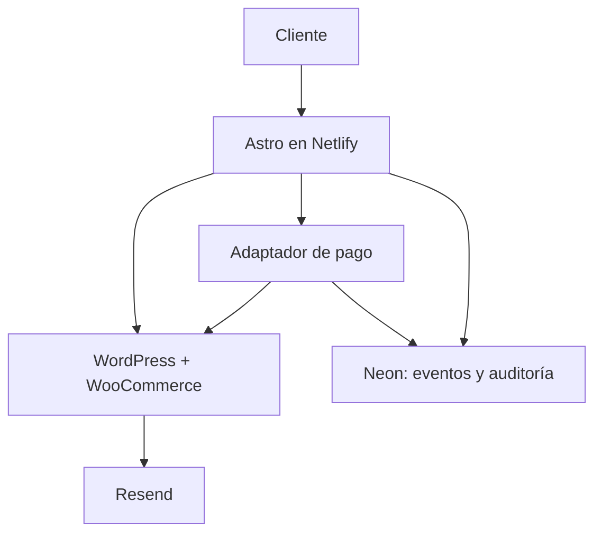
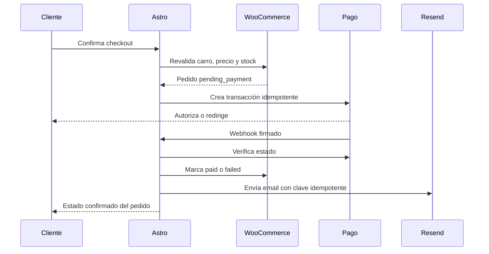
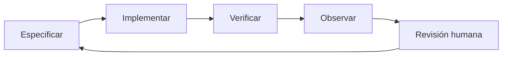

# PRD — Casa Trama Ecommerce Headless

**Versión:** 1.1  
**Fecha:** 28 de agosto de 2026  
**Mercado inicial:** Chile  
**Estado:** alineado con theme Astro y listo para discovery técnico, estimación y ejecución  
**Producto:** storefront premium de Casa Trama con Astro + WordPress/WooCommerce

---

## 1. Resumen ejecutivo

Casa Trama evolucionará desde un prototipo de experiencia hacia un ecommerce headless de producción para Chile. El storefront se construirá con **Astro 7.x —la versión estable más reciente disponible al iniciar el proyecto—**, desplegado en Netlify. WordPress y WooCommerce serán el back office donde las dueñas gestionarán contenido, productos, fotografías, precios, variantes, stock, promociones y pedidos.

La implementación utilizará obligatoriamente **`Casa_Trama_Astro_Theme_v1.0.0`** como base del storefront. El theme ya materializa la identidad visual, componentes, rutas, responsive, accesibilidad, catálogo de desarrollo y contratos iniciales con WooCommerce. No se reconstruirá la interfaz desde cero: el trabajo de producto conectará, extenderá y endurecerá esta base conforme a este PRD.

La meta no es solamente “tener una tienda rápida”. El producto debe combinar:

- una experiencia visual premium y consistente con el prototipo aprobado;
- una operación sencilla para el equipo de Casa Trama;
- compra sin fricción, especialmente desde teléfonos móviles;
- datos comerciales conciliables y sin duplicidad de inventario;
- una base técnica sobresaliente para SEO, GEO y AEO;
- medición completa desde la impresión de un producto hasta la compra;
- capacidad de cambiar el proveedor de pago sin rehacer el ecommerce;
- un proceso de desarrollo controlado por especificaciones, pruebas y evidencia.

### Decisión arquitectónica central

**WooCommerce será la fuente única de verdad para catálogo, SKU, precio, impuestos, stock, cupones y pedidos.** Neon no mantendrá un segundo inventario ni un segundo libro de pedidos. Se utilizará para datos propios de la aplicación: idempotencia, eventos de integración, auditoría, preferencias, proyecciones mínimas para reportería y colas de reintento.

Esta decisión reduce descuadres, sobreventa, correos duplicados y trabajo administrativo.

---

## 2. Interpretación de términos y supuestos

Para que el equipo pueda comenzar sin depender de aclaraciones posteriores, este PRD usa las siguientes interpretaciones:

| Término indicado | Interpretación de trabajo |
|---|---|
| “Raisin” | Se interpreta como **Resend**, proveedor de correo transaccional. Si se trata de otro servicio, se reemplaza únicamente el adaptador de email. |
| Harness | Conjunto ejecutable de reglas, contratos, pruebas, fixtures, scripts y puertas de calidad que permiten a humanos y agentes desarrollar sin desviarse del PRD. No se presupone Harness.io. |
| Loop | Ciclo cerrado de planificar → implementar → probar → observar → corregir → validar con una persona → liberar. |
| Driven Development | Combinación de **Spec-Driven, Contract-Driven, Test-Driven y Analytics-Driven Development**. |
| “Mejor empresa de texturas” | Posicionar a Casa Trama como referente chileno en textiles, fibras, materialidad, diseño y cuidado, con información útil y demostrable. |
| Prototipo actual | Autoridad visual del proyecto. No se rediseña arbitrariamente durante la implementación; se convierte en sistema de diseño y componentes. |

### Supuestos comerciales iniciales

- Moneda: CLP, manejada en montos enteros.
- País y despacho inicial: Chile.
- Idioma inicial: español de Chile (`es-CL`).
- IVA: configurado en WooCommerce conforme a la operación tributaria de Casa Trama.
- Checkout como invitado en P0; no se obliga a crear cuenta.
- Productos físicos con posibles colores, tamaños, composiciones o variaciones.
- Las decisiones sobre proveedor de pago, transporte, emisión tributaria y hosting de WordPress se cierran en Sprint 0.

### 2.1 Theme oficial de implementación

| Elemento | Definición obligatoria |
|---|---|
| Artefacto base | `Casa_Trama_Astro_Theme_v1.0.0` |
| Framework validado | Astro 7.2.9 + TypeScript estricto |
| Hosting preparado | Netlify mediante adaptador oficial |
| Estado técnico | Build validado sin errores, warnings ni hints |
| Catálogo de desarrollo | Datos mock reemplazables automáticamente por WooCommerce Store API |
| Autoridad visual operativa | Tokens, composición, componentes y responsive contenidos en el theme |

#### Reglas de uso

- El repositorio de producción se inicia desde el theme; no desde un starter genérico de Astro.
- Se conservarán sus design tokens, tipografías self-hosted, ritmos, paleta, navegación, componentes y criterios responsive, salvo cambio aprobado.
- El catálogo mock existe únicamente para desarrollo, QA y estados sin CMS. En producción, productos, precio y stock provienen de WooCommerce.
- Los componentes pueden refactorizarse para mantenibilidad o accesibilidad sin alterar la intención visual aprobada.
- El carro y checkout incluidos son la base de experiencia. La lógica real debe conectarse al Store API, pedidos, stock y proveedor de pago antes de activar cobros.
- Las fotografías del theme son demostrativas y deben sustituirse o complementarse con activos reales autorizados de Casa Trama.
- Cualquier cambio material de dirección visual requiere una preview, comparación con el theme y aprobación humana.
- El prototipo previo sigue siendo referencia de intención; cuando exista ambigüedad ejecutable, el theme es la base técnica y este PRD define el comportamiento.

#### Elementos del theme que deben preservarse o evolucionarse

- Home editorial y sistema de secciones.
- Navegación desktop/móvil y contador de carro.
- Tienda con filtros y orden.
- Fichas dinámicas de producto.
- Colecciones, historias y guía de fibras.
- Carro persistente y checkout chileno de demostración.
- Metadata, canonical, robots, sitemap y datos estructurados.
- `dataLayer` inicial de ecommerce.
- Conector `src/lib/commerce.ts` y modelos tipados.
- Documentación `README.md` y `docs/WORDPRESS-HEADLESS.md`.

---

## 3. Visión del producto

### Propuesta de valor

Casa Trama permitirá descubrir y comprar textiles premium entendiendo no solo su apariencia, sino su textura, composición, procedencia, uso, cuidado y valor. La experiencia debe transmitir materialidad aun cuando la persona no pueda tocar el producto.

### North Star

**Compras confirmadas de clientes adecuados, con una experiencia que protege el valor premium de la marca.**

No se optimizará exclusivamente por cantidad de sesiones ni por posiciones aisladas. El sistema debe conectar visibilidad, intención, comportamiento, compra, ticket y recurrencia.

### Objetivos de negocio

1. Vender productos directamente en el sitio con una operación confiable.
2. Disminuir la dependencia de mensajes manuales para responder dudas repetitivas.
3. Construir autoridad temática en texturas, fibras, diseño y cuidado.
4. Obtener información real sobre demanda, productos y fricciones de compra.
5. Permitir que el equipo comercial actualice la tienda sin intervención del desarrollador.
6. Preparar una arquitectura que pueda incorporar nuevos medios de pago, transporte, mercados o idiomas.

### Objetivos de producto

- Compra completa desde móvil sin bloqueos ni pasos innecesarios.
- Catálogo, precio y stock siempre provenientes de WooCommerce.
- Contenido principal presente en HTML inicial y accesible a buscadores.
- Edición controlada: libertad de contenido sin permitir que se rompa el diseño.
- Trazabilidad de cada transición de pedido, pago, inventario y email.
- Releases reproducibles, observables y reversibles.

### No objetivos de P0

- Marketplace con múltiples vendedores.
- Aplicación móvil nativa.
- ERP propio o contabilidad completa dentro de Neon.
- Personalizador 3D de productos.
- Programa de fidelización avanzado.
- Venta internacional o multimoneda.
- Recomendaciones generativas sin evidencia ni control editorial.
- Publicación automática masiva de contenido con IA.

---

## 4. Usuarios y trabajos principales

### 4.1 Compradora móvil

Quiere comprender el producto, confiar en la marca, confirmar disponibilidad, conocer despacho y pagar sin crear una cuenta. Necesita fotografías detalladas, composición clara, medidas, cuidado, devoluciones y un checkout corto.

### 4.2 Compradora de regalo

Busca orientación por ocasión, estilo, rango de precio o persona. Necesita reducir la incertidumbre, comparar alternativas y saber si el producto llegará a tiempo.

### 4.3 Compradora informada sobre materiales

Compara fibras, textura, origen, calidez, durabilidad y cuidado. Es clave para la estrategia SEO/GEO/AEO porque formula preguntas específicas antes de comprar.

### 4.4 Dueña o administradora de tienda

Necesita crear productos, subir fotografías, cambiar textos y precios, actualizar stock, ver pedidos y revisar estados sin tocar código.

### 4.5 Encargada de contenido/SEO

Necesita editar metadatos, bloques editoriales, enlaces internos, preguntas frecuentes, guías, autores, fuentes, imágenes y fechas de revisión.

### 4.6 Operaciones y soporte

Necesita localizar un pedido, revisar pago y despacho, reenviar una notificación, registrar una devolución y reconocer una inconsistencia.

---

## 5. Métricas de éxito

Los valores base se capturarán durante las primeras cuatro semanas. Las metas iniciales son puertas de calidad, no promesas comerciales.

### Conversión y comercio

| Métrica | Definición | Meta inicial |
|---|---|---:|
| Tasa de agregar al carro | `add_to_cart / view_item` | Establecer baseline y mejorar por cohorte |
| Inicio de checkout | `begin_checkout / view_cart` | ≥ 55% tras estabilización |
| Finalización de checkout | `purchase / begin_checkout` | ≥ 45% tras estabilización |
| Duplicidad de compra medida | `purchase` repetido por `transaction_id` | 0% |
| Pedidos con descuadre de monto | Total pagado distinto al pedido | 0 |
| Sobreventa atribuible al sistema | Venta sin stock disponible | 0 |
| Emails transaccionales duplicados | Mismo evento y pedido | 0 |

### Experiencia y rendimiento

Core Web Vitals deben evaluarse en datos de campo al percentil 75, segmentados por móvil:

- LCP ≤ 2,5 s.
- INP ≤ 200 ms.
- CLS ≤ 0,10.
- Tasa de error de checkout < 1% excluyendo rechazos legítimos del medio de pago.
- Lighthouse móvil en páginas de referencia: Performance ≥ 90, Accessibility ≥ 95, Best Practices ≥ 95 y SEO ≥ 95.

### Descubrimiento orgánico y autoridad

- 100% de URLs canónicas indexables con HTML inicial útil.
- 0 errores críticos persistentes en indexación, sitemap o datos estructurados.
- Cobertura válida de `Product`/`Offer` en productos elegibles.
- Crecimiento de clics no asociados a marca en clústeres prioritarios.
- Crecimiento de consultas y páginas que generan visitas con intención comercial.
- Medición separada de referencias desde motores y asistentes con IA cuando el dato esté disponible.
- Panel de respuestas objetivo para evaluar presencia, fuente citada, exactitud y evolución; nunca un “score GEO” inventado.

### Operación editorial

- Una administradora capacitada puede crear y publicar un producto sin ayuda técnica.
- Cambios editoriales visibles dentro del SLA de publicación.
- Historial de cambios y posibilidad de recuperación.

---

## 6. Alcance por prioridad

### P0 — Lanzamiento

- Uso de `Casa_Trama_Astro_Theme_v1.0.0` como punto de partida obligatorio.
- Home premium y editable.
- Catálogo, categorías y colecciones.
- Búsqueda y filtros esenciales.
- Ficha de producto completa.
- Variantes, precio, stock y estado de disponibilidad.
- Carro persistente.
- Checkout como invitado para Chile.
- Cálculo de despacho y total antes de pagar.
- Integración con un proveedor de pago chileno.
- Creación y actualización segura del pedido.
- Correos transaccionales con Resend.
- Blog/guías y páginas editoriales.
- SEO técnico, datos estructurados y sitemap.
- GTM, GA4 ecommerce, Search Console y Bing Webmaster Tools.
- Consentimiento, privacidad y páginas legales proporcionadas/validadas por Casa Trama.
- QA móvil, accesibilidad y rendimiento.

### P1 — Crecimiento

- Favoritos sin cuenta y sincronización opcional con cuenta.
- Reseñas verificadas.
- Guías de regalo, comparación y recomendación asistida por reglas.
- Recuperación de carro con consentimiento.
- Integración logística y seguimiento automatizado.
- Feed automatizado para Google Merchant Center.
- Listas de espera para productos agotados.
- Lookbooks y contenido comprable.
- Panel ejecutivo en Looker Studio.

### P2 — Expansión

- Cuentas de cliente y recompra rápida.
- Programa de fidelización.
- Segundo idioma/mercado.
- Segunda moneda.
- Personalización avanzada.
- Búsqueda semántica y asistente de compra con recuperación de información controlada.

---

## 7. Arquitectura de información y rutas

La estructura final se valida contra el prototipo y el inventario real de productos.

| Tipo | Ruta propuesta | Indexación |
|---|---|---|
| Home | `/` | Sí |
| Tienda | `/tienda/` | Sí |
| Categoría | `/categoria/{slug}/` | Sí si tiene valor propio |
| Colección | `/coleccion/{slug}/` | Sí |
| Producto | `/producto/{slug}/` | Sí |
| Material/fibra | `/materiales/{slug}/` | Sí, con contenido original |
| Guía | `/guias/{slug}/` | Sí |
| Blog | `/historias/` y `/historias/{slug}/` | Sí |
| Nosotros | `/casa-trama/` | Sí |
| Contacto | `/contacto/` | Sí |
| Búsqueda interna | `/buscar/` | No por defecto |
| Carro | `/carro/` | No |
| Checkout | `/checkout/` | No |
| Resultado de pago | `/pedido/{token}/` | No, tokenizado |
| Políticas | `/despachos/`, `/cambios-y-devoluciones/`, `/privacidad/`, `/terminos/` | Sí |

### Reglas para filtros

- Los filtros no crearán combinaciones indexables ilimitadas.
- Solo se crearán landing pages indexables para combinaciones con demanda y contenido propio.
- Parámetros de orden, vista, color o precio llevarán canonical a la categoría limpia y no entrarán al sitemap.
- El sitio nunca dependerá de scroll infinito para que un buscador descubra todos los productos; habrá URLs y paginación navegable.

---

## 8. Experiencia de usuario

### 8.1 Principios

1. **La textura debe sentirse visualmente:** fotografía macro, zoom útil, video corto opcional, iluminación y contexto de uso.
2. **Lujo silencioso:** jerarquía, aire, tipografía y movimiento sobrio; evitar interfaces recargadas.
3. **La confianza aparece antes del pago:** despacho, cambios, composición y disponibilidad cerca de la decisión.
4. **Móvil primero:** ningún contenido o función crítica existe solo en hover.
5. **Sin sorpresas:** total, costos y condiciones visibles antes de abandonar el sitio hacia el pago.
6. **Accesibilidad como calidad:** contraste, foco visible, teclado, lectores de pantalla y reducción de movimiento.

### 8.2 Home

- Hero editable con versión desktop y móvil, focal point, texto y CTA.
- Propuesta de valor concreta, no solamente una frase de marca.
- Colecciones destacadas.
- Bloque de materialidad o fibra.
- Productos seleccionados.
- Historia o proceso de Casa Trama.
- Prueba de confianza real: prensa, clientes, reseñas verificadas o atributos demostrables.
- Guías editoriales relacionadas.
- Captura de correo con consentimiento y expectativa clara.

### 8.3 Listado de productos

- Imágenes con proporción consistente y segunda vista opcional.
- Nombre, variante resumida, precio, disponibilidad y etiqueta solo cuando sea cierta.
- Filtros por tipo, material, color, rango de precio y disponibilidad, según catálogo real.
- Orden por destacados, novedades, precio y disponibilidad.
- Estado de filtros accesible y fácil de limpiar.
- Resultado, orden y filtros preservados al volver desde un producto.

### 8.4 Ficha de producto

- Galería optimizada con zoom y miniaturas accesibles.
- Nombre, precio CLP, variantes, stock y CTA visibles sin ambigüedad.
- Selección obligatoria de variante antes de agregar si corresponde.
- Composición, dimensiones, tacto/textura, peso o calidez cuando aplique.
- Origen, técnica, proceso o autora cuando esté respaldado.
- Cuidado y almacenamiento.
- Despacho, cambios y devolución en resumen con enlace a detalle.
- Preguntas específicas del producto, no FAQs copiadas en masa.
- Productos complementarios definidos por relación editorial o reglas claras.
- Datos estructurados generados desde los mismos datos visibles.

### 8.5 Carro

- Edición de cantidad y eliminación con feedback inmediato.
- Revalidación de precio y stock contra WooCommerce.
- Estimación de despacho cuando sea posible.
- Subtotal, descuento, despacho y total separados.
- CTA primario claro.
- Recuperación segura del carro mediante `Cart-Token` o identificador equivalente, sin almacenar datos de tarjeta.

### 8.6 Checkout

- Guest checkout por defecto.
- Pasos máximos recomendados: datos → despacho → pago, en una sola pantalla o flujo corto.
- Campos adaptados a Chile: nombre, email, teléfono, dirección, región y comuna; RUT solo si existe una necesidad operacional/tributaria validada.
- Autocompletado y mensajes de error junto al campo.
- Resumen del pedido persistente.
- Doble clic o reintento no crea dos pedidos ni dos cobros.
- El botón de pago explica que puede existir redirección externa.
- Confirmación final solo después de verificación server-to-server del pago.

### 8.7 Responsive y accesibilidad

- QA mínimo en 320, 360, 390, 768, 1024, 1280 y 1440 px.
- Objetivos táctiles de al menos 44 × 44 px.
- Tipografía legible sin zoom horizontal.
- Orden de foco lógico y salto a contenido.
- Modales con focus trap, escape y restitución de foco.
- `prefers-reduced-motion` respetado.
- Alternativas textuales editoriales; no generar alt text genérico como relleno.
- Cumplimiento objetivo: WCAG 2.2 AA.

---

## 9. Editabilidad en WordPress

La tienda debe ser ampliamente editable, pero no debe permitir que una edición accidental rompa la experiencia.

### 9.1 Qué editarán las dueñas

| Área | Datos editables | Control |
|---|---|---|
| Identidad | Logo, datos de contacto, redes, textos globales | Opciones globales |
| Navegación | Menú y jerarquía permitida | Menús WP |
| Aviso superior | Texto, enlace, vigencia, activación | Campo global |
| Home | Hero, imágenes, orden de módulos permitidos, CTA, destacados | Bloques estructurados |
| Producto | Título, slug, SKU, precio, stock, variantes, imágenes, ficha material | WooCommerce |
| Categoría/colección | Nombre, descripción, imagen, módulos editoriales | Taxonomías + campos |
| Contenido | Guías, historias, autoría, fecha de revisión | Tipos de contenido |
| SEO | Title, description, canonical excepcional, social image, indexación controlada | Campos SEO |
| Políticas | Contenido legal, versiones y fecha de vigencia | Páginas protegidas por rol |

### 9.2 Qué no será edición libre

- Código de analítica y GTM.
- Llaves de pago, Resend, WooCommerce, Netlify o Neon.
- Reglas de firma de webhooks.
- Identificadores de transacción.
- Máquina de estados de pedidos.
- Plantillas de schema.
- Canonical masivo, robots o redirects críticos sin rol técnico.
- Diseño libre mediante un page builder que pueda quebrar el sistema visual.

### 9.3 Modelo editorial recomendado

- Gutenberg con bloques propios y una lista blanca de bloques, o ACF Pro + WPGraphQL para ACF.
- Campos con validación, valores por defecto y ayuda contextual.
- Imágenes con focal point, texto alternativo, pie y crédito opcional.
- Preview de cambios en un deploy de Netlify antes de producción.
- Revisiones de WordPress y roles separados: administradora, operaciones, editora y SEO.

---

## 10. Modelo de contenido y producto

### Producto

- `id`, `sku`, `slug`, estado y visibilidad.
- Nombre comercial y descripción breve.
- Descripción editorial extensa.
- Tipo de producto y colección.
- Composición/fibras con porcentajes estructurados.
- Textura/tacto mediante vocabulario controlado.
- Color y código de color editorial.
- Medidas, peso y tolerancias.
- Técnica, origen, elaboración y procedencia de materiales cuando estén respaldados.
- Instrucciones de cuidado.
- Precio regular, precio de oferta y vigencia.
- Stock, umbral, backorder y estado.
- Variaciones y atributos.
- Galería, imagen OG y video opcional.
- Relaciones: complementarios, similares, guía de cuidado y material.
- Datos SEO y fecha de revisión.

### Contenidos editoriales

- Material/fibra.
- Técnica/proceso.
- Guía de cuidado.
- Guía de estilo o regalo.
- Historia/entrevista.
- Pregunta y respuesta.
- Autora/revisora con experiencia demostrable.

### Vocabularios controlados

Para mejorar filtros, consistencia editorial y comprensión de máquinas, valores como fibra, técnica, textura, ocasión, estación y tipo no serán textos libres cuando deban funcionar como atributos.

---

## 11. Arquitectura técnica objetivo

### 11.1 Stack

| Capa | Tecnología | Rol |
|---|---|---|
| Storefront | `Casa_Trama_Astro_Theme_v1.0.0`, Astro 7.2.9 + TypeScript estricto | Base visual, HTML, rutas, SSR selectivo y composición |
| Interactividad | React islands solo donde aporte valor | Filtros, galería, carro y checkout |
| Estilos | Design tokens + CSS/Tailwind estable | Sistema visual y responsive |
| CMS | WordPress | Contenido y flujo editorial |
| Comercio | WooCommerce con HPOS validado | Catálogo, stock, pedidos, impuestos y cupones |
| Lectura editorial | WPGraphQL + campos estructurados | Páginas, guías, autores y ajustes |
| Comercio público | WooCommerce Store API | Productos, carro y checkout |
| Operación segura | WooCommerce REST API v3 server-to-server | Conciliación y tareas privadas |
| Hosting frontend | Netlify + adaptador oficial de Astro | Build, CDN, Functions y previews |
| Datos de aplicación | Neon Postgres | Idempotencia, auditoría, eventos y proyecciones |
| Email | Resend | Correos transaccionales |
| Observabilidad | Logs estructurados + Sentry o equivalente | Errores, trazas y alertas |
| Medición | GTM + GA4 + GSC + Bing | Producto, adquisición y orgánico |

Astro 7 incorporó mejoras de build, Vite 8, compilador en Rust y logs estructurados; se instalará con `astro@latest` y se fijará la versión exacta en el lockfile. No se usarán rangos flotantes en producción.

### 11.2 Estrategia de renderizado

- Home, páginas institucionales, guías y contenido estable: prerender estático.
- Categorías y colecciones: estático con reconstrucción por publicación, salvo que el volumen exija render bajo demanda.
- Producto: HTML inicial completo, render bajo demanda o caché CDN con invalidación; precio y disponibilidad deben estar presentes para usuario y schema.
- Carro, checkout y pedido: render dinámico, privado y sin caché compartida.
- Stock: revalidación en tiempo real antes de agregar y antes de pagar.
- Contenido principal nunca dependerá de una interacción del usuario para aparecer ante el crawler.

### 11.3 Componentes principales



### 11.4 Reglas de integración

- Ninguna credencial privada se envía al navegador.
- El storefront consume datos públicos directamente o mediante una capa BFF cuando se necesite normalización, caché o protección.
- Las mutaciones sensibles pasan por funciones server-side.
- Todo webhook valida firma, timestamp, esquema e idempotencia.
- Los contratos de API se tipan y validan en runtime.
- Los fallos reintentables pasan a una cola lógica con dead-letter y alerta.

---

## 12. Fuente de verdad y conciliación

### 12.1 Matriz de propiedad

| Dato | Fuente de verdad | Copia permitida |
|---|---|---|
| SKU/producto | WooCommerce | Caché de lectura |
| Precio/IVA/descuento | WooCommerce | HTML/caché con TTL |
| Stock | WooCommerce | Solo lectura temporal |
| Carro | Woo Store API | Token en cliente seguro |
| Pedido | WooCommerce | Proyección mínima en Neon |
| Estado del pago | Proveedor de pago, reflejado en Woo | Eventos inmutables en Neon |
| Contenido editorial | WordPress | Build/CDN |
| Estado del email | Resend | Eventos en Neon |
| Analítica | GA4/GSC/Bing | Warehouse o dashboard opcional |

### 12.2 Máquina de estados del pedido

Estados mínimos normalizados:

- `cart`
- `pending_payment`
- `payment_processing`
- `paid`
- `payment_failed`
- `preparing`
- `shipped`
- `completed`
- `cancelled`
- `refunded_partial`
- `refunded_total`

Las transiciones se definen en código y se prueban. Una URL de retorno del navegador **no** acredita por sí sola un pago. La confirmación debe provenir del proveedor mediante verificación server-to-server o consulta firmada.

### 12.3 Flujo de compra



### 12.4 Conciliación automática

- Job periódico para pedidos `pending_payment` o `payment_processing` más antiguos que el umbral definido.
- Consulta al proveedor y comparación de `order_id`, monto, moneda y estado.
- Corrección solo mediante transiciones permitidas.
- Registro inmutable de evento recibido, hash, intento, resultado y timestamp.
- Alerta por monto distinto, webhook inválido, pedido huérfano o pago sin pedido.
- Informe diario: creados, pagados, fallidos, cancelados, reembolsados y discrepancias.
- Herramienta de reintento para una persona autorizada, sin volver a cobrar.

### 12.5 Stock

- WooCommerce reserva/reduce stock según una política documentada.
- La variación, no solo el producto padre, controla stock cuando corresponda.
- El stock se revalida al agregar, al iniciar checkout y antes de crear la transacción.
- Un webhook repetido no reduce stock dos veces.
- Agotados permanecen publicados si aportan valor, con alternativa o lista de espera; los discontinuados siguen una política SEO específica.

---

## 13. Proveedor de pago intercambiable

El pago se implementará detrás de un contrato `PaymentProvider`:

- `createPayment(order)`
- `getPaymentStatus(reference)`
- `verifyWebhook(headers, body)`
- `refund(reference, amount)`
- `mapProviderStatus(status)`
- `getPublicConfiguration()`

### Candidatos a evaluar en Sprint 0

- Transbank Webpay Plus.
- Mercado Pago.
- Flow.
- Otro proveedor solicitado por Casa Trama.

### Criterios de decisión

- conversión y confianza para clientes chilenos;
- comisión y plazo de abono;
- soporte de devolución total/parcial;
- calidad de API, sandbox y webhooks;
- compatibilidad headless real;
- estabilidad del checkout móvil;
- conciliación y reportes;
- soporte operacional.

La selección del proveedor no será un campo editable por una editora de contenido. Cambiarlo será una operación técnica controlada, con configuración segura, pruebas sandbox, prueba real de monto mínimo y plan de rollback.

---

## 14. Correos transaccionales con Resend

### P0

- Pedido recibido.
- Pago confirmado.
- Pago rechazado o incompleto con próximo paso seguro.
- Pedido en preparación.
- Pedido enviado con seguimiento si existe.
- Cancelación.
- Reembolso.
- Notificación interna de nueva venta o incidente.

### Reglas

- Dominio de envío verificado con SPF, DKIM y DMARC.
- Plantillas alineadas con el sistema visual.
- Una sola capa es responsable de cada tipo de email; no se envía el mismo correo desde WooCommerce y Resend.
- Clave idempotente por `event_type/order_id/version`.
- Webhooks de entrega, rebote y complaint verificados y almacenados.
- No enviar datos de tarjeta ni información innecesaria.
- Separar email transaccional de marketing y respetar consentimiento.

---

## 15. SEO técnico

### 15.1 Indexabilidad

- HTML semántico y contenido crítico renderizado en servidor/build.
- `lang="es-CL"` y moneda CLP.
- Un solo dominio canónico HTTPS, con redirects consistentes entre variantes.
- Canonical autorreferente en páginas indexables.
- Estados HTTP correctos: 200, 301, 404 y 410 según caso.
- Carro, checkout, resultados de búsqueda interna, cuenta y pedidos con `noindex`.
- Paginación rastreable mediante enlaces HTML.
- Nada crítico bloqueado por robots o cargado únicamente después de clic/swipe.

### 15.2 Sitemap y descubrimiento

- Sitemap index por productos, categorías/colecciones, páginas y contenidos.
- Solo URLs canónicas, 200 e indexables.
- `lastmod` basado en cambios reales, no en cada build.
- Sitemap de imágenes cuando aporte cobertura adicional.
- Envío a Search Console y Bing Webmaster Tools.
- IndexNow para altas, cambios relevantes y bajas, con reintentos controlados.
- Feed de Merchant Center en P1 o antes si existe capacidad operacional.

### 15.3 Datos estructurados

- `Organization` y `WebSite` globales.
- `BreadcrumbList` en jerarquías.
- `Product` + `Offer` en productos, usando precio, moneda, stock y URL reales.
- `AggregateRating` y `Review` solo cuando sean visibles, legítimos y verificables.
- `Article`/`BlogPosting` en contenido editorial.
- `Person` para autoras/revisoras cuando exista información pública suficiente.
- `FAQPage` solo donde corresponda al contenido visible; no prometer rich result.
- Validación automática de schema y Rich Results Test en QA.
- El marcado se genera desde la misma entidad que muestra la interfaz para evitar contradicciones.

### 15.4 Contenido, imágenes y enlaces

- Titles y H1 únicos orientados a intención y lenguaje real del cliente.
- Metadescripciones editables y sin automatización genérica.
- URLs cortas, persistentes y sin fechas innecesarias.
- Imágenes AVIF/WebP con `srcset`, tamaños explícitos, focal point y alt editorial.
- Enlaces internos entre producto, material, técnica, cuidado, colección y guía.
- Breadcrumbs visibles.
- Páginas agotadas con alternativas; productos reemplazados con 301 a equivalente real.
- Mapa de redirects antes de cualquier cambio de dominio o slug.

---

## 16. GEO y AEO

### Principio rector

GEO/AEO no se implementará como una colección de trucos separados. La guía oficial de Google para funciones generativas indica que las buenas prácticas SEO continúan siendo la base y que no existe un requisito especial para aparecer en AI Overviews o AI Mode. Por ello, el proyecto priorizará información útil, verificable, accesible e inequívoca.

### 16.1 Base técnica

- Contenido útil y atributos de producto en HTML inicial.
- Entidades consistentes: marca, producto, material, colección, autora y ubicación.
- JSON-LD coherente con contenido visible.
- URLs estables, canonical y enlaces rastreables.
- Imágenes originales de alta calidad para búsqueda multimodal.
- Merchant Center y Business Profile actualizados cuando corresponda.
- Controles de snippets definidos deliberadamente; evitar restricciones que eliminen elegibilidad sin motivo.

### 16.2 Sistema editorial de autoridad

Se crearán clústeres alrededor de preguntas que preceden la compra:

- diferencias entre fibras y mezclas;
- cómo se siente una textura y para qué clima sirve;
- cuidado, lavado, guardado y durabilidad;
- cómo elegir una pieza por uso, ocasión o regalo;
- medidas, caída y formas de uso;
- origen, técnica y proceso;
- criterios para reconocer calidad;
- comparaciones honestas entre materiales.

Cada contenido relevante debe incluir, cuando corresponda:

- respuesta breve y directa;
- explicación profunda;
- tabla o pasos cuando faciliten comprensión;
- experiencia propia de Casa Trama;
- fotografías o demostraciones originales;
- autora y revisora;
- fecha de publicación y revisión;
- fuentes primarias para afirmaciones técnicas;
- enlaces a productos y guías relacionadas.

### 16.3 Contenido citable

- Definiciones precisas y no promocionales.
- Afirmaciones de materiales respaldadas; evitar “sustentable”, “artesanal” o “hipoalergénico” sin evidencia.
- Bloques de preguntas con respuestas visibles y específicas.
- Tablas comparativas que declaren la dimensión comparada.
- Datos propios: cuidado observado, pruebas, proceso, origen, entrevistas y fotografías.
- Citas y fuentes identificables.

### 16.4 Medición GEO/AEO

- Referral traffic desde asistentes cuando se identifique.
- Landing page y conversión por fuente IA.
- Panel mensual de un conjunto fijo de preguntas comerciales e informativas.
- Por cada pregunta: presencia, posición relativa cuando exista, fuente citada, exactitud, competidores y cambio respecto al periodo anterior.
- Guardar evidencia y fecha; no transformar observaciones inestables en una puntuación absoluta.
- `llms.txt` puede incorporarse como archivo informativo experimental, pero no se presentará como factor de ranking ni reemplazo de sitemap, schema o arquitectura.

---

## 17. Analítica y reportería

### 17.1 Data layer versionada

Se define un contrato `dataLayer` independiente de los componentes visuales. No se enviará PII a GA4, Google Ads u otras plataformas.

### Eventos GA4 ecommerce

| Evento | Momento | Identidad principal |
|---|---|---|
| `view_item_list` | Se muestra una lista | `item_list_id` |
| `select_item` | Se elige un producto | SKU/variation ID |
| `view_item` | Ficha cargada | SKU/variation ID |
| `add_to_cart` | Woo confirma agregado | SKU + cantidad |
| `remove_from_cart` | Woo confirma retiro | SKU + cantidad |
| `view_cart` | Vista de carro | cart ID anónimo |
| `begin_checkout` | Checkout iniciado | cart/order draft |
| `add_shipping_info` | Despacho confirmado | shipping tier |
| `add_payment_info` | Método elegido, sin datos sensibles | payment type |
| `purchase` | Pago confirmado por servidor | Woo order ID |
| `refund` | Reembolso confirmado | Woo order ID |
| `search` | Búsqueda interna | término saneado |
| `generate_lead` | Contacto o consulta enviada | form type |

### Reglas de calidad de datos

- `purchase` se emite una sola vez por `transaction_id`.
- El monto proviene del pedido confirmado, no del DOM.
- Se especifica si `value` incluye impuestos y despacho, y la regla no cambia entre eventos.
- Todos los items usan el mismo `item_id` durante el funnel.
- WhatsApp se mide como evento secundario, no como compra.
- DebugView y Tag Assistant forman parte de QA.
- Se valida la diferencia entre pedidos Woo, pagos del proveedor y compras GA4.

### 17.2 Integraciones preparadas

- Google Tag Manager web desde configuración de entorno.
- GA4 ecommerce.
- Google Search Console, propiedad de dominio.
- Bing Webmaster Tools e IndexNow.
- Google Merchant Center.
- Google Ads/Meta solo con consentimiento y solicitud explícita.
- Server-side tagging como evolución, no requisito para bloquear el lanzamiento.

### 17.3 Reportería

Dashboard mensual con:

- ingresos, pedidos, ticket promedio, conversión y reembolsos;
- funnel por dispositivo, canal, landing y categoría;
- productos vistos, agregados, comprados y abandonados;
- búsquedas internas sin resultados;
- Core Web Vitals y errores;
- clics, impresiones y consultas orgánicas;
- cobertura de indexación y datos estructurados;
- visibilidad observada en respuestas con IA;
- concordancia Woo ↔ pago ↔ GA4.

---

## 18. Rendimiento

### Presupuestos iniciales

- JavaScript inicial de home: objetivo ≤ 90 KB gzip.
- JavaScript inicial de producto: objetivo ≤ 130 KB gzip.
- Cero hidratación para contenido estático.
- Imagen LCP móvil optimizada, con tamaño y prioridad explícitos; objetivo orientativo ≤ 200 KB cuando la calidad visual lo permita.
- Fuentes self-hosted, subconjuntos necesarios y `font-display` adecuado.
- Sin scripts de terceros antes del consentimiento salvo los estrictamente necesarios.
- Caché CDN para contenido público con política de invalidación documentada.
- APIs con timeout, fallback y manejo de errores; ninguna espera indefinida bloquea la página.

### Pruebas

- Lighthouse CI en home, listado, producto, carro y checkout.
- WebPageTest o equivalente con perfil móvil chileno antes de lanzamiento.
- Monitoreo real de Web Vitals después de producción.
- Presupuestos fallan CI cuando existe una regresión relevante.

---

## 19. Seguridad, privacidad y continuidad

### Seguridad

- Secretos solo en variables cifradas de entorno.
- Credenciales Woo privadas exclusivamente server-side.
- CSP, headers de seguridad y lista de orígenes permitidos.
- Sanitización del HTML proveniente de WordPress.
- Rate limiting en checkout, formularios y webhooks.
- Firma de webhooks y protección contra replay.
- Idempotencia en pagos, pedidos y emails.
- Actualizaciones de dependencias automatizadas con revisión.
- Backups probados de WordPress/WooCommerce y Neon.
- Mínimo privilegio para roles y llaves.
- Registro de auditoría sin secretos ni datos de tarjeta.
- El sistema no toca ni almacena PAN, CVV ni credenciales bancarias.

### Privacidad Chile

- Minimización de datos y finalidad explícita.
- Aviso de privacidad y consentimiento separado para marketing.
- Inventario de proveedores y tratamiento de datos.
- Plazos de retención definidos.
- Flujo para acceso, rectificación, eliminación u oposición según normativa aplicable.
- Preparación para la Ley 21.719, cuya vigencia está prevista para el 1 de diciembre de 2026.
- Revisión legal de términos, privacidad, despacho y cambios antes del go-live. Este PRD no sustituye asesoría legal.

### Continuidad

- Ambientes separados: local, preview, staging y producción.
- Base de prueba con datos sintéticos o anonimizados.
- Rollback de frontend a deploy anterior.
- Plan documentado si WordPress, pago, Resend o Neon quedan temporalmente indisponibles.
- Página de estado de pago no debe afirmar éxito mientras el estado sea desconocido.

---

## 20. Harness + Loop de desarrollo

### 20.1 Fuente de verdad del proyecto

El repositorio debe contener:

```text
/docs
  /prd
  /adr
  /contracts
  /analytics
  /runbooks
/src
/tests
  /unit
  /contract
  /integration
  /e2e
  /visual
```

- PRD versionado.
- ADR por decisiones importantes.
- Esquemas de datos y APIs.
- Design tokens.
- Matriz de eventos.
- Criterios de aceptación ejecutables.
- Runbooks de pagos, webhooks, conciliación, rollback e incidentes.

### 20.2 Harness ejecutable

Comando único sugerido: `pnpm verify`.

Debe ejecutar:

1. formato y lint;
2. TypeScript estricto;
3. pruebas unitarias;
4. validación de contratos de WordPress/WooCommerce/pago;
5. pruebas de integración con fixtures;
6. build de Astro;
7. link checker y canonical checker;
8. validación de sitemap, robots y schema;
9. accesibilidad automática;
10. Playwright E2E;
11. comparación visual de rutas críticas;
12. Lighthouse CI y presupuestos;
13. escaneo de secretos y dependencias.

Un agente de código puede implementar, pero no puede omitir ni modificar una puerta de calidad para lograr que el pipeline pase.

### 20.3 Loop de trabajo



Para cada vertical slice:

1. Escribir historia, criterio de aceptación y contrato.
2. Crear prueba o fixture que falle.
3. Implementar el cambio mínimo completo.
4. Ejecutar `pnpm verify`.
5. Generar preview de Netlify.
6. Revisar responsive, visual, contenido y datos.
7. Obtener aprobación humana cuando afecte pago, stock, analítica, SEO o producción.
8. Liberar detrás de flag cuando exista riesgo.
9. Observar métricas y errores.
10. Registrar aprendizaje y actualizar PRD/ADR.

### 20.4 Puertas humanas obligatorias

- Aprobación del diseño convertido desde el prototipo.
- Elección y activación del proveedor de pago.
- Mapeo de stock y reglas de impuestos.
- Contenido legal.
- Metadatos y redirects de migración.
- Configuración de analítica y consentimiento.
- Lanzamiento a producción.

---

## 21. Estrategia de pruebas

### Unitarias

- Normalización de precios CLP.
- Mapeo de variantes y stock.
- Cálculo/representación de totales.
- Máquina de estados.
- Generación de canonical y schema.
- Idempotency keys.

### Contratos

- WPGraphQL y campos obligatorios.
- Woo Store API: productos, carro y checkout.
- Woo REST API y webhooks.
- Proveedor de pago sandbox.
- Resend y webhook de eventos.

### Integración

- Producto publicado → visible en storefront.
- Cambio de precio → HTML, carro y schema coherentes.
- Cambio de stock → CTA y checkout coherentes.
- Pedido → pago → Woo → email → analítica.
- Reembolso total y parcial.

### E2E

- Compra guest exitosa en móvil y desktop.
- Pago rechazado y reintento seguro.
- Doble clic en pagar.
- Webhook duplicado o fuera de orden.
- Producto agotado durante checkout.
- Cupón válido/inválido.
- Dirección/región/comuna con errores.
- Navegación completa por teclado.

### Visual

- Home, listado, producto, carro y checkout.
- Breakpoints críticos.
- Texto largo, producto sin oferta, agotado y variaciones.
- Estados de error, vacío, carga y éxito.

### UAT de dueñas

- Crear producto.
- Cargar/ordenar fotografías.
- Crear variación.
- Ajustar precio y stock.
- Destacar en home.
- Publicar una guía.
- Ver pedido y cambiar estado operacional.
- Confirmar que no necesitan acceder al código.

---

## 22. Criterios de aceptación del MVP

El MVP puede pasar a producción cuando:

1. Una administradora crea un producto completo desde WordPress y aparece correctamente sin intervención técnica.
2. Precio, stock y variantes coinciden entre producto, carro, checkout y pedido.
3. Una compra sandbox y una compra real controlada completan todo el ciclo.
4. Un webhook duplicado no duplica pedido, stock, email ni evento GA4.
5. Un retorno manipulado no puede marcar un pago como exitoso.
6. El pedido pagado queda visible en WooCommerce y conciliado con el proveedor.
7. Los correos se entregan una sola vez y usan el dominio verificado.
8. Home, listado, producto, carro y checkout superan QA responsive y accesibilidad.
9. Las rutas indexables entregan HTML útil, canonical, metadata y status correctos.
10. Sitemap, robots y schemas pasan validación.
11. `purchase` usa el ID y monto reales del pedido y no contiene PII.
12. Search Console, Bing y GA4 quedan preparados/verificados con accesos del cliente.
13. Existe rollback probado y runbook de incidente de pago.
14. No existen errores P0/P1 abiertos.
15. La implementación deriva del theme oficial y conserva sus contratos visuales, responsive y de accesibilidad, o documenta mediante ADR cada modificación aprobada.

---

## 23. Plan de ejecución propuesto

Estimación inicial: **10 a 12 semanas**, condicionada por disponibilidad de contenidos, hosting WordPress, proveedor de pago y accesos. No es un compromiso cerrado hasta completar Sprint 0.

| Sprint | Duración | Resultado |
|---|---:|---|
| 0. Discovery y reconciliación | 1 semana | Inventario de pantallas, decisiones, contratos, migración, riesgos y backlog |
| 1. Fundación | 1 semana | Adopción del theme oficial, Astro 7, Netlify, ambientes, CI y Harness |
| 2. CMS y catálogo | 1–2 semanas | WordPress/Woo, modelo editorial, productos, imágenes y preview |
| 3. Storefront premium | 1–2 semanas | Home, listados, búsqueda, filtros y ficha de producto |
| 4. Comercio | 2 semanas | Carro, checkout Chile, stock, despacho y cupones |
| 5. Pago, pedidos y email | 1–2 semanas | Adaptador, webhooks, conciliación, Resend y runbooks |
| 6. SEO/GEO/AEO y medición | 1 semana | Schema, sitemap, IndexNow, GTM, GA4, GSC y Bing |
| 7. Hardening y go-live | 1–2 semanas | UAT, accesibilidad, rendimiento, seguridad, migración y producción |

### Estrategia de entrega

Cada sprint debe terminar en una preview navegable y verificable. No se esperará hasta el final para integrar pago, stock, responsive o SEO.

---

## 24. Backlog de historias críticas

### Administración

- Como dueña, quiero crear un producto con fotografías, precio y stock para venderlo sin pedir un cambio al desarrollador.
- Como dueña, quiero cambiar los módulos destacados de la home sin alterar tipografías o espaciados.
- Como operaciones, quiero ver el estado real del pago y del pedido para responder a una clienta.

### Compra

- Como compradora, quiero entender material, medidas, textura y cuidado para decidir con confianza.
- Como compradora móvil, quiero pagar como invitada con pocos campos.
- Como compradora, quiero conocer el total y el despacho antes de confirmar.
- Como compradora, quiero recibir confirmación inequívoca sin riesgo de doble cobro.

### Descubrimiento

- Como buscador, quiero HTML, enlaces, canonical, sitemap y schema coherentes para descubrir y entender el catálogo.
- Como persona que consulta una respuesta con IA, quiero encontrar información clara, demostrable y atribuible a Casa Trama.
- Como editora, quiero enlazar una guía de material con todos los productos relacionados.

### Analítica

- Como responsable de negocio, quiero saber qué producto fue visto, agregado, iniciado y comprado.
- Como analista, quiero conciliar WooCommerce, proveedor de pago y GA4 sin contar compras dos veces.

---

## 25. Riesgos y mitigaciones

| Riesgo | Impacto | Mitigación |
|---|---|---|
| Doble fuente de inventario | Sobreventa y trabajo manual | WooCommerce como única fuente |
| Plugin de pago no compatible con headless | Bloqueo de checkout | Probar API/sandbox y usar adaptador propio |
| Webhook duplicado o tardío | Estado incorrecto | Firma, idempotencia, eventos y conciliación |
| Editabilidad excesiva | Diseño inconsistente | Bloques estructurados y roles |
| Rebuild por cada cambio de stock | Costos y lentitud | SSR/caché para producto + revalidación Store API |
| Schema distinto al precio visible | Pérdida de elegibilidad | Una sola entidad de datos y pruebas automáticas |
| Scripts de tracking degradan la UX | Menor conversión/CWV | Consentimiento, carga diferida y budgets |
| Contenido GEO genérico | Poca autoridad | Experiencia propia, evidencia, autoría y revisión |
| Datos legales incompletos | Riesgo reputacional/legal | Revisión profesional antes de producción |
| Dependencia de una persona técnica | Continuidad baja | Runbooks, Harness, roles y documentación |

---

## 26. Decisiones abiertas de Sprint 0

1. Confirmar que “Raisin” corresponde a Resend.
2. Proveedor de pago P0 y cuenta comercial disponible.
3. Reglas de despacho, cobertura, tarifas y transportista.
4. Necesidad de boleta/factura e integración tributaria.
5. Hosting y dominio seguro para WordPress.
6. Catálogo definitivo, variantes y política de stock/reserva.
7. Cupones, promociones y precios de oferta.
8. Flujo de cambios, devoluciones y reembolsos.
9. Validación final de correspondencia entre prototipo, theme oficial y activos reales de marca.
10. Dominio productivo y mapa de URLs/redirects si existe un sitio anterior.
11. Responsable de contenidos, fotografías y aprobaciones.
12. Si “Harness” y “Loop” se refieren además a productos específicos que deban integrarse.

Estas decisiones no cambian la arquitectura central; determinan configuración, alcance final y estimación.

---

## 27. Definition of Done

Una tarea solo está terminada cuando:

- parte del theme oficial o documenta por qué una pieza debe sustituirse;
- cumple la especificación y criterios de aceptación;
- cuenta con pruebas proporcionales al riesgo;
- pasa `pnpm verify`;
- funciona en preview y breakpoints acordados;
- tiene estados vacío, error, carga y éxito;
- respeta accesibilidad y presupuestos de rendimiento;
- no expone secretos ni PII;
- mantiene analytics, SEO, canonical y schema cuando aplica;
- actualiza documentación/ADR si modifica una decisión;
- fue aprobada por una persona en flujos críticos.

---

## 28. Fuentes técnicas de referencia

- [Astro 7.0 — anuncio oficial](https://astro.build/blog/astro-7/)
- [Astro en Netlify — documentación oficial](https://docs.netlify.com/build/frameworks/framework-setup-guides/astro/)
- [Adaptador oficial de Astro para Netlify](https://docs.astro.build/en/guides/integrations-guide/netlify/)
- [WooCommerce Store API](https://developer.woocommerce.com/docs/apis/store-api/)
- [Cart Tokens para implementaciones headless](https://developer.woocommerce.com/docs/apis/store-api/cart-tokens/)
- [WordPress REST API](https://developer.wordpress.org/rest-api/)
- [WPGraphQL para WooCommerce](https://www.wpgraphql.com/extenstion-plugins/wpgraphql-for-woocommerce)
- [Neon Serverless Driver](https://neon.com/docs/serverless/serverless-driver)
- [Resend: claves de idempotencia](https://resend.com/docs/dashboard/emails/idempotency-keys)
- [Google: datos estructurados de Product](https://developers.google.com/search/docs/appearance/structured-data/product)
- [Google: ecommerce y datos estructurados](https://developers.google.com/search/docs/specialty/ecommerce/include-structured-data-relevant-to-ecommerce)
- [Google: funciones de IA y sitios web](https://developers.google.com/search/docs/appearance/ai-features)
- [Google: guía de optimización para funciones generativas](https://developers.google.com/search/docs/fundamentals/ai-optimization-guide)
- [Google Analytics: eventos ecommerce recomendados](https://support.google.com/analytics/answer/9267735)
- [Bing: envío de URLs e IndexNow](https://www.bing.com/webmasters/help/URL-Submission-62f2860b)
- [Ley 21.719 — Biblioteca del Congreso Nacional de Chile](https://www.bcn.cl/leychile/navegar?idNorma=1209272)

---

## 29. Recomendación final de arquitectura

**`Casa_Trama_Astro_Theme_v1.0.0` será la base de la experiencia y crecimiento; WordPress/WooCommerce, el cerebro comercial y editorial; Neon, la memoria técnica de integraciones; y el proveedor de pago, un módulo intercambiable.**

Esto permite que Casa Trama mantenga autonomía sobre su tienda, mientras el equipo técnico conserva control sobre rendimiento, seguridad, medición, indexación y calidad. La ventaja competitiva no provendrá de una tecnología aislada, sino de que catálogo, contenido, experiencia, evidencia, medición y operación funcionen como un solo producto.
